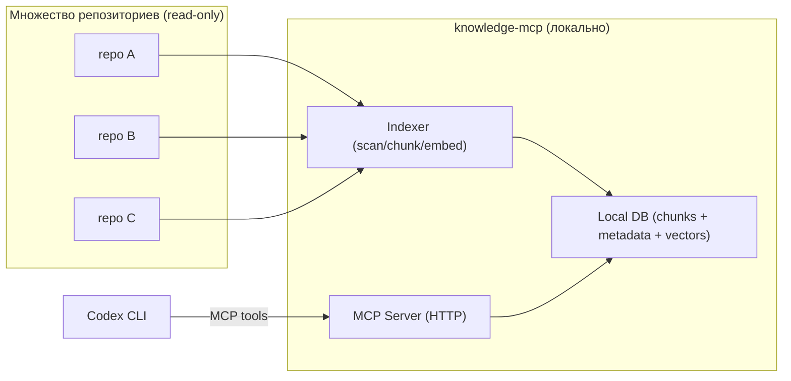

# ADR-001: Локальная межрепозиторная база знаний (RAG) через MCP для Codex

| Метаданные | Значение |
| :--- | :--- |
| **Статус** | Предложено |
| **Дата** | 2026-03-19 |
| **Автор** | Root |
| **Затрагивает** | Developer Tooling, Codex CLI, MCP, локальная база знаний |
| **Breaking Change** | Нет |

---

## Контекст

Нужно обеспечить "память" и поиск по знаниям **между репозиториями** для ИИ-ассистента (Codex), сохраняя базу знаний **локально** (без отправки содержимого репо во внешние сервисы).

Цель: построить базу знаний, удобочитаемую и удобоиспользуемую **нейросетевыми агентами** (RAG retrieval + ссылки на источники).

Ключевой принцип для этой задачи:
- **Source of truth = кодовая база.** Новая KB строится по исходникам (парсинг/анализ кода), а не по существующему vault/документации.
- `docs/` и `knowledge/` можно просматривать/индексировать только как *неавторитетные* подсказки (например, для поиска мест в коде, терминологии, примеров), потому что документация может отставать и быть неверной по отношению к коду.

Источники в этом репозитории (пример), с разным уровнем доверия:
- **Авторитетные (обязательные):** исходники в `C:\Repos\Yurta.Core.Lib\` (`*.cs`, `*.csproj`, `*.sln`, `*.props`, и т.п.)
- **Неавторитетные (опциональные):** `C:\Repos\Yurta.Core.Lib\docs\`, `C:\Repos\Yurta.Core.Lib\knowledge\`

Дополнительный контекст:
- В репозитории присутствует маркер `C:\Repos\Yurta.Core.Lib\.arscontexta`, который обозначает vault Ars Contexta. В текущем состоянии vault-хуки отключены (`git: false`, `session_capture: false`), но корпус знаний в `C:\Repos\Yurta.Core.Lib\knowledge\` используется как входной материал.
- В проекте одновременно используются две версии BMad: legacy-конфиг `C:\Repos\Yurta.Core.Lib\.bmad-core\core-config.yaml` и текущий конфиг `C:\Repos\Yurta.Core.Lib\_bmad\core\config.yaml`. В текущей версии BMad `project_knowledge` должен указывать на локальную knowledge base (например, `{project-root}/knowledge`) для grounding.
- Codex не исполняет Claude-style slash-команды вида `/arscontexta:*`; вместо этого доступ к памяти должен быть реализован как MCP-инструменты.
  - Для этого репозитория целевой абсолютный путь knowledge base: `C:\Repos\Yurta.Core.Lib\knowledge` (в конфиге допускается плейсхолдер `{project-root}`).

Требуется единый локальный сервис, который:
1. Сканирует и индексирует множество репозиториев.
2. Предоставляет retrieval API для RAG (достать релевантные фрагменты с метаданными и ссылками на источник).
3. Подключается к Codex как MCP server.

---

## Проблема

1. **Нет межрепозиторной памяти для Codex "из коробки".** Сессии и контекст не формируют единую долговременную базу знаний по всем репо.
2. **Нельзя отдавать базу знаний наружу.** Нужен офлайн/локальный режим, допустим Docker на локальной машине.
3. **Нужны гарантии трассируемости.** Любой retrieved контент должен быть связан с источником: `repo`, `path`, позиция (строки/диапазон), `commit`/`sha` (если доступно).
4. **RAG должен быть практичным, не академическим.** Реальные ответы должны опираться на быстрый поиск + векторный retrieval (hybrid), но система обязана иметь деградацию до текстового поиска, если embedding недоступен.
5. **Документация может быть неверной.** Нельзя считать `docs/` и `knowledge/` истиной; retrieved-фрагменты из документации должны помечаться как "требует верификации" и не должны попадать в KB как проверенный факт без подтверждения кодом.

---

## Решение

Сделать отдельный репозиторий с микроприложением (далее `knowledge-mcp`), которое поднимается локально (в Docker) и включает:

1. **Indexer (CLI/Job):**
   - Сканирует репозиторий с приоритетом кода (allowlist типов файлов).
   - Извлекает знания из кода:
     - лексический/синтаксический анализ (минимум: функции/классы/интерфейсы/атрибуты/DI extensions/Options)
     - извлечение ссылок между сущностями (symbol graph)
     - построение "fact records" (агентный формат), где каждый факт имеет доказательство в коде (references)
   - Нормализует найденное в "чанки" (chunking) в формате, удобном для агентного retrieval.
   - Генерирует метаданные (repo_id, path, language, hash/mtime, git sha, tags).
   - Считает embedding (опционально) через локальный провайдер.
   - Пишет данные в локальную БД.
   - Опционально: сканирует `docs/` и `knowledge/` как "подсказки", но сохраняет их отдельно от подтверждённых фактов из кода и с пониженным trust level.

2. **Store (локальная БД):**
   - По умолчанию: SQLite (простота, переносимость, volume).
   - Поддержка:
     - полнотекстового поиска (FTS)
     - хранения чанков и метаданных
     - хранения векторов (если выбран vector backend) либо через отдельную БД/движок.

3. **MCP Server (HTTP):**
   - Экспортирует инструменты для Codex:
     - `knowledge.search(query, repo?, path_glob?, tags?, top_k?)`
     - `knowledge.get_chunk(id)` / `knowledge.get_document(path, repo)`
     - `knowledge.upsert_note(...)` (опционально: человеческие заметки поверх индексируемых фактов)
   - Возвращает результаты с обязательными полями источника (repo/path/line_start/line_end/sha).
   - Возвращает и поля доверия:
     - `source_kind`: `code` | `docs` | `knowledge`
     - `trust`: `verified` (код) | `hint` (документация)

4. **Docker-first развёртывание:**
   - `docker compose up -d` поднимает сервис на `127.0.0.1:<port>`.
   - Данные хранятся в docker volume/локальной папке.
   - Сервис не требует внешней сети для работы (кроме необязательной первоначальной установки моделей).

5. **Конфигурация мульти-репо (обязательно):**
   - Явный список корней репозиториев (локальные пути) + `repo_id`.
   - Монтирование репозиториев в контейнер как read-only volume (или запуск indexer на host), чтобы не требовать копирования исходников.
   - Инкрементальная индексация по `repo_id` (частичный reindex выбранного репо).

---

## Варианты (и почему нет)

### Вариант A: Хостить удалённо (облачная БД + API)

Отклонено: противоречит требованию "не отдавать базу знаний наружу".

### Вариант B: Только полнотекстовый поиск (без embedding)

Недостаточно для кода и концептуальных запросов: BM25/FTS часто проигрывает по recall там, где важна семантика.
Допустимо как fallback при отсутствии embedding.

### Вариант C: Использовать существующий vault (Obsidian/Ars Contexta) без MCP

Недостаточно: нет стандартизированного retrieval API для подключения к Codex как инструментов, и нет автоматической индексации исходников/мульти-репо.

---

## Сопоставление с текущими практиками

1. `C:\Repos\Yurta.Core.Lib\knowledge\` и `C:\Repos\Yurta.Core.Lib\docs\` полезны как ориентиры, но не считаются истиной. Новая KB должна строиться по коду, а документы использоваться только как `hint`.
2. BMad-workflow используют `project_knowledge` для grounding. В рамках этого ADR это не источник истины, а источник контекстных подсказок. Истина проверяется по коду.
3. `knowledge-mcp` строит машиночитаемую KB поверх множества репо и хранит строгую provenance: что извлечено из кода, а что является подсказкой из документации.

---

## Архитектура (в общих чертах)

---

## Требования (для внешнего ассистента)

### Функциональные

1. Индексация нескольких репозиториев с явным `repo_id`.
2. Chunking для:
   - Markdown (по заголовкам/секции)
   - исходников (по размеру + эвристике границ, минимум по строкам)
3. Hybrid retrieval:
   - text search (FTS/BM25)
   - vector search (embedding)
   - объединение результатов (например, reciprocal rank fusion)
4. Возврат источников:
   - `repo_id`, `path`, `line_start`, `line_end`
   - `content` (фрагмент)
   - `sha` (если репо git и sha доступен)
5. Конфигурация ignore/allow:
   - `.git/`, `bin/`, `obj/`, `.idea/`, `.vs/`, `node_modules/`
   - исключение секретов: `*.pfx`, `*.pem`, `*.key`, `appsettings.*.json` (по списку)
6. Источники по умолчанию (важно):
   - Исходники индексируются всегда и имеют `source_kind=code`.
   - `docs/**` и `knowledge/**` по умолчанию:
     - либо полностью исключены из индекса,
     - либо индексируются в отдельную коллекцию `hints` с `trust=hint` (не смешивать с `verified`).
7. Выходной формат KB (для агентов):
   - База знаний хранится как структура данных для retrieval (chunks + metadata + optional vectors).
   - Опционально: экспорт/дамп в `jsonl` для автономных офлайн-агентов (без требований к человеческой навигации).
8. Доказательность фактов:
   - Любой факт с `trust=verified` должен иметь хотя бы одну ссылку на код (`repo_id`, `path`, `line_start`, `line_end`, `sha`).
   - Факты без ссылок допускаются только как `trust=hint` (например, из документации/README), и должны маркироваться как "требует проверки".

### Нефункциональные

1. Локальность данных: сервис не отправляет индексируемый контент наружу.
2. Быстрый инкрементальный reindex:
   - пропуск неизменённых файлов по `mtime + size` и/или по `hash`
3. Наблюдаемость:
   - логи индексации (сколько файлов/чанков, ошибки парсинга)
4. Простота развёртывания:
   - Docker Compose, один командный путь запуска

---

## Предложение по реализации (референс)

Это не жёсткое требование, но ориентир для внешнего ассистента:

1. Язык: Python или Go (быстрый time-to-delivery).
2. Хранилище:
   - SQLite + FTS как baseline.
   - Вектора:
     - отдельный backend (например, Qdrant в Docker) либо
     - хранение в SQLite, если выбран простой подход (с учётом размеров).
3. Embedding провайдеры (плагин):
   - `none` (FTS-only)
   - `ollama` (локально; модель поднимается в Docker отдельно)
   - `openai` (строго опционально, выключено по умолчанию)

---

## Интеграция с Codex

Codex подключается к MCP server локально.

Ожидаемый UX:
1. Поднять сервис: `docker compose up -d`
2. Добавить MCP server в Codex CLI (или в `~/.codex/config.toml`).
3. В диалоге просить ассистента использовать инструменты `knowledge.search`/`knowledge.get_chunk` перед ответом.

---

## План реализации (Definition of Done для внешнего ассистента)

1. Репозиторий `knowledge-mcp` с `docker-compose.yml`, который поднимает MCP server и локальную БД (volume).
2. CLI-команда индексации (или фоновой job), принимающая конфиг списка репозиториев.
3. Рабочие MCP tools: `knowledge.search` и `knowledge.get_chunk` (минимум).
4. Инкрементальная индексация и базовые метрики/логи.
5. Документация по подключению к Codex и по локальной модели embeddings (опционально).

---

## Ссылки на документы (абсолютные пути, текущий репозиторий)

Это документы/файлы, упомянутые в контексте и требованиях ADR:
- `C:\Repos\Yurta.Core.Lib\docs\` (проектная документация; индексируется как входной корпус)
- `C:\Repos\Yurta.Core.Lib\knowledge\` (корпус знаний; индексируется как входной корпус)
- `C:\Repos\Yurta.Core.Lib\.arscontexta` (маркер vault Ars Contexta + локальная конфигурация)
- `C:\Repos\Yurta.Core.Lib\.bmad-core\core-config.yaml` (legacy BMad core config, multi-library контекст)
- `C:\Repos\Yurta.Core.Lib\_bmad\core\config.yaml` (текущий BMad core config, включая `project_knowledge`)
- `C:\Repos\Yurta.Core.Lib\knowledge\guides\index.md` (точка входа существующего корпуса знаний; индексируется как входной корпус)

---

## Риски

| Риск | Вероятность | Митигация |
|------|-------------|-----------|
| Большой объём данных, индекс разрастается | Средняя | инкрементальная индексация, TTL для transient-чанков, лимиты по типам файлов |
| Утечки секретов через индекс | Средняя | жёсткий denylist расширений и путей, опционально regex-маскирование |
| Низкое качество retrieval без embeddings | Высокая (если embeddings выключены) | hybrid подход + возможность локального embedding через Ollama |
| Зависимость от docker/runtime у пользователя | Низкая | предоставить и docker-way, и native запуск (опционально) |
| Документация вводит в заблуждение | Средняя | разделение `verified` vs `hint`, приоритет кода, provenance + ссылки на код |

---

## Статус

**Предложено.** Следующий шаг: завести отдельный репозиторий `knowledge-mcp` и реализовать baseline (FTS + MCP tools), затем расширить до hybrid retrieval с локальными embeddings.
