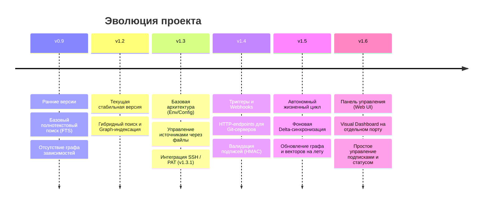

# Дорожная карта (Roadmap): Автономная работа и подписка на триггеры

В этом документе описан план будущих доработок для перевода MCP-сервера базы знаний в автономный режим работы. Основная цель — настроить автоматическое реагирование на изменения в подключенных репозиториях.
Текущая версия продукта: **v1.2**

---

## Визуализация дорожной карты

---

## v1.3: Базовая конфигурация (Env / Файл настроек)
*Оценка: Минорное обновление (базовый парсинг настроек)*
- Настройка первичной конфигурации подписок и триггеров через переменные окружения (`.env`) или файл конфигурации (`config.yaml` / `settings.json`).
- Это позволит настроить автономную работу сразу при запуске контейнера, без обязательного использования визуальных интерфейсов.

## v1.3.1: Источники обновления (Sources)
*Оценка: Патч (расширение возможностей конфигурации из v1.3)*
- Определение параметров для различных источников (в первую очередь, Git-репозиториев) в конфигурации.
- Управление учетными данными для безопасного доступа к закрытым репозиториям:
  - Поддержка аутентификации через SSH-ключи.
  - Аутентификация через Personal Access Tokens (PAT).

## v1.4: Настройка триггеров (Triggers)
*Оценка: Минорное обновление (добавление новых HTTP-эндпоинтов и логики)*
- Определение и гибкий выбор событий, инициирующих автоматическое обновление базы знаний:
  - `Push` (пакет коммитов) в целевую ветку (например, `master` или `main`).
  - Успешное выполнение `Merge Request` / `Pull Request`.
  - Периодическое обновление по заданному расписанию (Cron).
- Реализация механизмов аутентификации для входящих вебхуков (Webhooks) от Git-серверов:
  - Валидация криптографических подписей (например, через Shared Secrets / HMAC), выставляемых GitHub/GitLab, чтобы система доверяла источнику сигнала.

## v1.5: Жизненный цикл обработки (Integration Flow)
*Оценка: Минорное обновление (системная интеграция и оптимизация)*
- Маршрутизация: привязка системных триггеров к существующим внутренним бизнес-процессам (фоновая синхронизация репозиториев, частичная индексация только измененных файлов, удаление устаревших данных).
- Парсинг полезной нагрузки: извлечение релевантных путей файлов из полезной нагрузки вебхука (payload) и передача их компоненту `Indexer` для оптимизации вычислений (Delta-sync).

## v1.6: Веб-интерфейс настройки (Web UI)
*Оценка: Минорное обновление (крупная автономная фича)*
- Внедрение веб-интерфейса в самую последнюю очередь как надстройки над конфигурацией.
- Запуск легковесного визуального UI на отдельном порту (например, `8080`), но в рамках **того же контейнера**, что и MCP сервер.
- Внедрение простой системы авторизации для ограничения доступа к панели настроек и визуального управления подписками.
